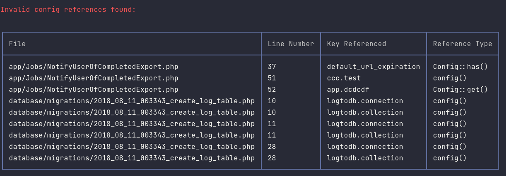

# Check for undefined configuration key references in your Laravel project.

[](https://packagist.org/packages/chrisdicarlo/laravel-config-checker)
[](https://github.com/chrisdicarlo/laravel-config-checker/actions?query=workflow%3Arun-tests+branch%3Amain)
[](https://github.com/chrisdicarlo/laravel-config-checker/actions?query=workflow%3Arun-php-8.1-tests+branch%3Amain)
[](https://github.com/chrisdicarlo/laravel-config-checker/actions?query=workflow%3A"Fix+PHP+code+style+issues"+branch%3Amain)
[](https://packagist.org/packages/chrisdicarlo/laravel-config-checker)

This package adds an Artisan command to check for invalid configuration file references in your application code and Blade views.

## Support me

**Feel like shouting out a thank you?** [Buy me a coffee! ☕️](https://buymeacoffee.com/chrisdicarlo)

## Installation

You can install the package via composer:

```bash
composer require chrisdicarlo/laravel-config-checker
```


## Usage
From the command-line, simply run:
```bash
php artisan config:check
```

The command will scan your Php code under `app` and your Blade views under `resources/views`.  Any errors will be displayed in a table with information on the location and missing reference:



### Disabling progress

To disable progress bars (e.g. in CI), pass the `--no-progress` flag when running the command:
```bash
php artisan config:check --no-progress
```

### Specifying the file type to check

To skip checking of Php or Blade files, pass `--no-php` or `--no-blade` respectively:
```bash
php artisan config:check --no-php
php artisan config:check --no-blade
```

## Testing

```bash
composer test
```

## Changelog

Please see [CHANGELOG](CHANGELOG.md) for more information on what has changed recently.

## Contributing

Please see [CONTRIBUTING](CONTRIBUTING.md) for details.

## Security Vulnerabilities

Please review [our security policy](../../security/policy) on how to report security vulnerabilities.

## Credits

- [Chris Di Carlo](https://github.com/chrisdicarlo)
- [All Contributors](../../contributors)

## License

The MIT License (MIT). Please see [License File](LICENSE.md) for more information.
